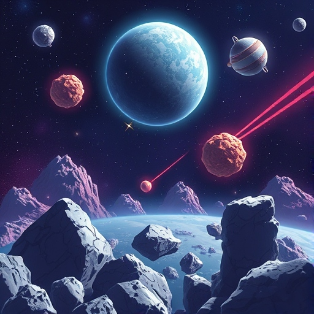
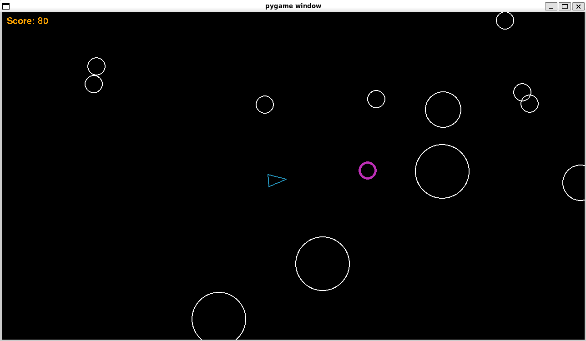

# Asteroids


A rudimentary version of Atari Asteroids written using the [pygame]("https://www.pygame.org/docs/) library in python. The player controls a ship and attempts to score as many points as possible by destroying asteroids with its shots. Points are awarded for shooting an asteroid and are inversely related with the asteroid's size (biggest asteroid = less points, and vice versa). When asteroids are destroyed, they split into two smaller asteroids and move faster. If that asteroid is already the smallest possible, it is fully destroyed. The player is prevented from going outside the bounds of the game. Many of the game's settings (player speed, asteroid size, screen size, etc.) can be altered. When a player collides with an asteroid, the game ends, the program closes, and the final score is printed.

## Installation Instructions

1. Install [pygame]("https://www.pygame.org/wiki/GettingStarted")

```
python3 -m pip install -U pygame --user
```

2. Alter settings

You can edit the `contants.py` to change the game's settings, if you wish

3. Run the game

```
python3 main.py
```

## How to play



1. Control your ship's movement with the WASD keys.
2. Press space to shoot (note there is a cooldown between shots).
3. Destroy as many asteroids as possible without colliding and maximize your score!

&nbsp;

> [!IMPORTANT]
> You must have pygame installed in order to play!
